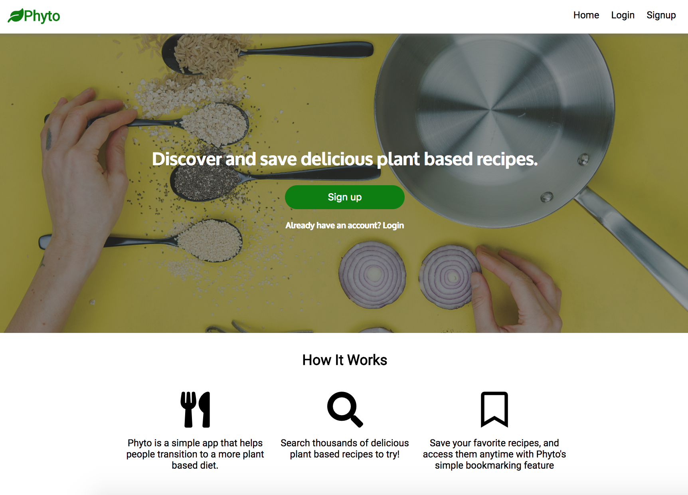
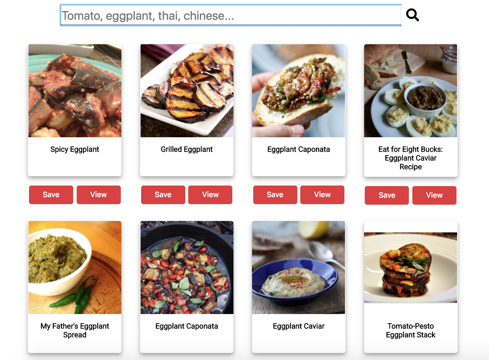
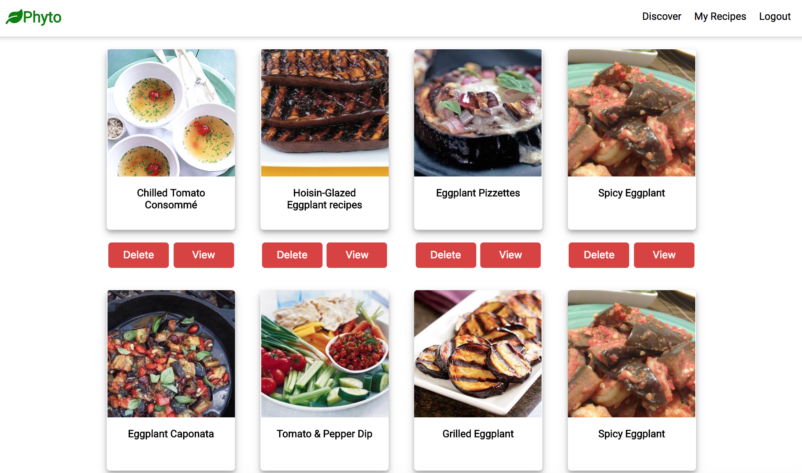

# Phyto
Phyto is a plant based recipe discovery and bookmarking app.  Phyto is for those who would like to make the transition to eating a more plant based diet.  

## Demo
[Live Demo](https://phyto.netlify.com/)

For a demo account use the following credentials: 
Username:  demouser
Password:  demopassword 

## Screenshots
Landing Page

Searchpage

My Recipes

## Technology 

### Front-End
* HTML5
* CSS3
* Javscript
* React
* Redux

### Back-End
View [Server Code](https://github.com/KevinAsuncion/phyto-api)
* Node
* Express
* MongoDB
* Mongoose
* Bcrypt
* Passport

### Testing
* Mocha
* Chai
* Enzyme
* Jest

## Features
* Search by ingredient or cuisine for plant based recipes
* Save your favorite recipes to your My Recipes page
* Remove a recipe from your favorites
* View a recipe 
